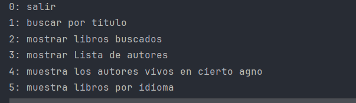
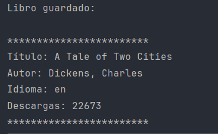

# :books: CONSULTA INTERACTIVA DE LIBROS


Aplicación de consola desarrollada en Java que permite buscar libros por título, consultar autores, filtrar por idioma y ver autores vivos en un año específico. Utiliza la API de [Gutendex](https://gutendex.com/) para obtener información de libros, y almacena los resultados localmente mediante JPA.

## :hammer: Funcionalidades del proyecto

- `Búsqueda de libros`: Busca libros por título desde una API externa.
- `Persistencia`: Guarda los libros y autores encontrados en base de datos usando JPA.
- `Consulta de autores`: Muestra todos los autores guardados y filtra por año de vida.
- `Filtro por idioma`: Lista libros almacenados por idioma (español, inglés, francés, portugués).
- `Evita duplicados`: Verifica si un libro ya existe en la base de datos antes de guardarlo.

## :ballot_box_with_check: Tecnologías utilizadas

- `Java 17`
- `Spring Boot`
- `Spring Data JPA`
- `Jackson`: Para deserialización de JSON
- `H2 / PostgreSQL / MySQL` (según configuración)
- `Gutendex API`: Fuente de datos externa

## :clipboard: Instrucciones de uso

1. Asegúrate de tener Java 17 o superior instalado.
2. Clona el proyecto y abre en tu IDE favorito (como IntelliJ o Eclipse).
3. Dirígete al archivo `src/main/resources/application.properties` y configura los datos de conexión a tu base de datos (ver ejemplo abajo).
4. Ejecuta la clase `Principal.java` como una aplicación Spring Boot.
5. Usa el menú interactivo que aparecerá en la consola para operar la aplicación:

Seleccione una opción:
0: Salir
1: Buscar por título
2: Mostrar libros buscados
3: Mostrar lista de autores
4: Mostrar autores vivos en cierto año
5: Mostrar libros por idioma


## :gear: Configuración del archivo `application.properties`

A continuación, un ejemplo usando **H2 en memoria** (para pruebas rápidas) y otro para **MySQL**:

### 🔹 H2 (base de datos en memoria)

```properties
spring.datasource.url=jdbc:h2:mem:librosdb
spring.datasource.driverClassName=org.h2.Driver
spring.datasource.username=sa
spring.datasource.password=
spring.jpa.database-platform=org.hibernate.dialect.H2Dialect
spring.h2.console.enabled=true
spring.jpa.hibernate.ddl-auto=update
```

🔹 MySQL
```
spring.datasource.url=jdbc:mysql://localhost:3306/librosdb
spring.datasource.username=root
spring.datasource.password=tu_contraseña
spring.jpa.hibernate.ddl-auto=update
spring.jpa.properties.hibernate.dialect=org.hibernate.dialect.MySQLDialect
spring.jpa.show-sql=true
```
    ⚠️ Asegúrate de que tu base de datos esté creada y el puerto sea accesible.

:file_folder: Estructura del Proyecto
```
    Principal.java: Clase principal con el menú interactivo.

    ObtenerDatos.java: Encargada de hacer las solicitudes HTTP a la API externa.

    ConvierteDatos.java: Usa Jackson para convertir JSON en objetos Java.

    Libros.java: Entidad JPA para representar libros.

    Autor.java: Entidad JPA para representar autores.

    IAutorRepository.java: Repositorio JPA para consultas de autores.

    ILibroRepository.java: Repositorio JPA para consultas de libros.

    DatosLibros / RespuestaBusqueda.java: Modelos para mapear la respuesta JSON de Gutendex.
```
### 🏁 Menú principal de la consola


### 🔍 Resultado de una búsqueda y guardado
